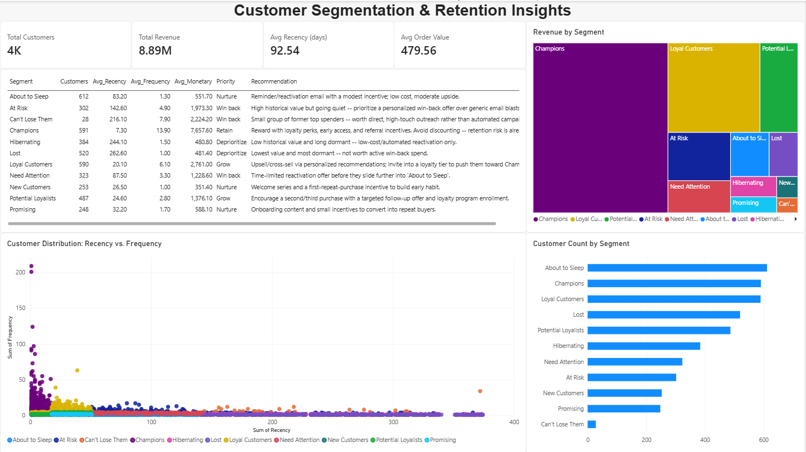

# Customer Segmentation using RFM Analysis

Week 2 project for the **Syntecxhub Data Analysis Internship**. A customer segmentation model built on Recency, Frequency, and Monetary (RFM) analysis, with an interactive Power BI dashboard surfacing which customers to retain, grow, win back, or deprioritize.



## Objective

Clean a raw transactional dataset, compute RFM metrics per customer, segment customers into behaviorally meaningful groups, and translate those segments into targeted marketing recommendations, presented as an interactive dashboard.

## Dataset

- **Source:** [Online Retail dataset](https://archive.ics.uci.edu/dataset/352/online+retail) (UCI Machine Learning Repository)
- **Size:** 541,909 transaction line items, Dec 2010 – Dec 2011
- **Fields:** InvoiceNo, StockCode, Description, Quantity, InvoiceDate, UnitPrice, CustomerID, Country
- Raw file included at `data/Online Retail.xlsx`

## Tools Used

- **Python (pandas)** - data cleaning and RFM calculation
- **Power BI Desktop** - data modeling and interactive dashboard
- **DAX** - live KPI measures

## Data Cleaning

- **Dropped rows with no CustomerID** (24.9% of the dataset) - RFM requires attributing every transaction to a specific customer, so these are unusable.
- **Removed cancellations** (InvoiceNo starting with `C`) and any other non-positive quantity rows - RFM should reflect genuine purchasing behavior, not net of returns.
- **Removed rows with UnitPrice ≤ 0** - non-sale adjustments, not real transactions.
- **Dropped 5,268 exact duplicate rows.**
- Converted `CustomerID` to an integer and added a `TotalPrice` (Quantity × UnitPrice) column for the Monetary calculation.

392,692 clean line items across 4,338 customers remained after cleaning.

## RFM Methodology

- **Recency** - days since each customer's most recent invoice, measured from a fixed snapshot date (one day after the dataset's last transaction).
- **Frequency** - count of distinct invoices per customer (not raw line items, since one invoice can contain many product lines).
- **Monetary** - total revenue per customer across all transactions.
- Each metric was scored **1–4 by quartile** (rank-based, to handle heavy ties in Frequency without breaking the quartile cut).
- **Segments** were assigned from the combination of R and F scores (16 possible combinations mapped to 11 segment labels - Champions, Loyal Customers, At Risk, Can't Lose Them, Hibernating, Lost, etc.). Monetary was used to prioritize *within* segments rather than define them, since Recency and Frequency describe behavior patterns while Monetary describes value.

## Dashboard

A single executive page: KPI cards (Total Customers, Total Revenue, Avg Recency, Avg Order Value), a revenue-by-segment treemap, a customer-count-by-segment bar chart, a segment summary table with tailored recommendations, and a Recency-vs-Frequency scatter plot showing all 4,338 customers individually, colored by segment.

## Key Insights

- **Champions + Loyal Customers** make up just **27% of the customer base** but generate **~69% of total revenue** - a textbook Pareto pattern.
- **At Risk** customers (302 people) carry the third-highest average spend but haven't purchased in ~143 days on average - high-value customers going quiet, worth targeted win-back rather than generic campaigns.
- **Can't Lose Them** is a tiny group (28 customers) with the second-highest average spend and frequency, but 216 days dormant - few enough to warrant direct, high-touch outreach rather than automated campaigns.
- **Lost + Hibernating** together account for ~21% of customers but under 5% of total revenue - low-value, long-dormant segments where aggressive win-back spend has poor ROI.

## Repository Structure

```
Syntecxhub_Customer_RFM_Analysis/
├── rfm_analysis.py
├── Syntecxhub_Customer_Segmentation_and_Retention_Insights.pbix
├── Syntecxhub_Customer_Segmentation_and_Retention_Insights.pdf
├── data/
│   ├── Online Retail.xlsx
│   ├── rfm_customer_level.csv
│   └── rfm_segment_summary.csv
├── screenshots/
│   └── dashboard.png
└── README_RFM.md
```

## About

Built as part of the [Syntecxhub](https://www.syntecxhub.com) Data Analysis Internship Program - Week 2.
